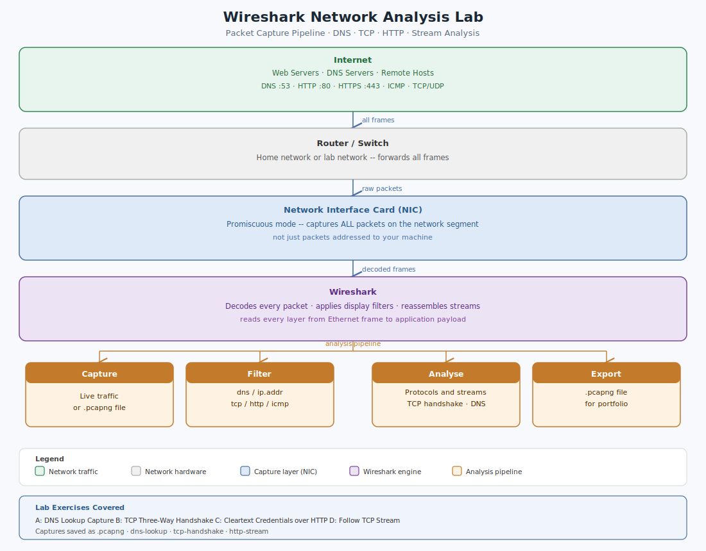

# Wireshark Network Analysis Lab — Packet Capture and Traffic Inspection


A hands-on network traffic analysis lab built using Wireshark. Covers live packet capture, display filter construction, TCP handshake inspection, DNS query analysis, cleartext credential identification over HTTP, and full TCP stream reconstruction. Skills map directly to SOC analyst, incident responder, network engineer, and cloud security roles.

---

## 1. The Problem This Lab Solves

Networks carry everything an organization produces: emails, database queries, login credentials, file transfers, API calls. When something goes wrong — a service is unreachable, a user reports slow performance, a security alert fires — the network is almost always involved. The only way to know what is actually happening is to look at the packets.

Wireshark is the industry-standard tool for doing exactly that. It captures raw data moving across a network interface and lets you inspect it at every layer, from the Ethernet frame up to the application payload.

| Role | How this lab applies |
|---|---|
| SOC Analyst | Identify malicious traffic patterns, extract indicators of compromise from packet captures |
| Network Engineer | Diagnose connectivity issues by seeing exactly where packets are dropped or delayed |
| Cloud Security Engineer | The mental model from Wireshark transfers directly to reading Azure Network Watcher and VPC flow logs |
| Help Desk | Prove a reported network issue is real, and determine whether it is client-side or server-side |
| Incident Responder | Reconstruct full conversations between hosts from individual packet captures |

---

## 2. Architecture



The NIC is the critical layer here. In promiscuous mode, it captures every packet on the network segment, not just packets addressed to the local machine. That raw stream is what Wireshark decodes, filters, and reassembles into readable conversations.

---

## 3. Environment

| Field | Value |
|---|---|
| Tool | Wireshark (free, open source, no expiration, no account required) |
| Platform | Windows local machine |
| Protocol coverage | DNS, HTTP, HTTPS, TCP, ICMP |
| Cost | $0 |
| Time to complete | 2-4 hours across multiple sessions |
| Certification alignment | CompTIA Network+, Security+, CySA+ |

---

## 4. Key Concepts

### Packets
A packet is a discrete unit of data transmitted across a network. Large payloads (a web page, an email, a file) are broken into many individual packets, each carrying a header (source IP, destination IP, port number) and a payload (the actual data). Wireshark captures and displays each packet individually.

### Protocols
A protocol is the ruleset that defines how data is formatted and transmitted. Different protocols handle different jobs: DNS resolves names, HTTP transfers web content, TCP guarantees delivery, ICMP handles diagnostics. Each has its own port number and packet structure and can be isolated in Wireshark with a display filter.

### TCP Three-Way Handshake
Before two hosts can exchange data over TCP, they negotiate a connection in three steps:

| Step | Packet | Meaning |
|---|---|---|
| 1 | SYN | Client: I want to connect. Here is my sequence number. |
| 2 | SYN-ACK | Server: Received. Here is my sequence number. Connection accepted. |
| 3 | ACK | Client: Confirmed. Ready to send data. |

A SYN with no SYN-ACK following it means the connection was refused or the server is unreachable. A RST packet means the connection was forcibly closed. These two patterns are what network engineers look for first when diagnosing connectivity problems.

### DNS
DNS translates human-readable domain names (google.com) into IP addresses (142.250.80.46) that machines use to route traffic. A DNS query fires before every website visit, API call, and email delivery. If DNS is broken, nothing works. Unexpected DNS queries in a capture, like repeated lookups to unusual external domains, are often the first indicator of malware communicating with a command and control server.

### HTTP vs HTTPS
HTTP transfers web content in plaintext. Anyone positioned on the network path between client and server can read every request and response, including credentials submitted in login forms. HTTPS adds TLS encryption on top, making the payload unreadable even if the packets are captured. Exercise C in this lab demonstrates the HTTP vulnerability directly.

### Promiscuous Mode
By default, a NIC only captures packets addressed to the local machine. In promiscuous mode, it captures every packet on the network segment. Wireshark enables this automatically on capture start.

---

## 5. Lab Exercises

### 5.1 First Capture
1. Open Wireshark and double-click the active interface (the one with the most traffic activity in the wave graph)
2. Navigate to any website in a browser
3. After 30 seconds, click the red Stop button
4. Observe the volume of packets generated by a short browsing session

This establishes why display filters are essential before any analysis begins.

### 5.2 Essential Display Filters

Type filters into the filter bar at the top of the window. The packet list updates instantly.

| Filter | What it shows | When to use it |
|---|---|---|
| `dns` | All DNS queries and responses | Troubleshooting name resolution, spotting unusual domain lookups |
| `http` | Unencrypted HTTP traffic | Finding cleartext data, debugging web apps |
| `tcp` | All TCP traffic | Starting point for connectivity investigations |
| `tcp.flags.syn == 1` | TCP SYN packets only | Seeing which hosts are trying to connect |
| `tcp.flags.reset == 1` | TCP RST packets | Finding refused or forcibly closed connections |
| `icmp` | All ICMP traffic including ping | Verifying basic reachability between hosts |
| `ip.addr == 192.168.1.1` | All traffic to or from a specific IP | Isolating one host in a busy capture |
| `ip.src == 10.0.0.5` | Traffic from a specific source IP | Isolating outbound traffic from one host |
| `tcp.port == 443` | All HTTPS traffic by port | Identifying encrypted web traffic |
| `http.request` | HTTP GET and POST requests | Finding web requests, spotting data exfiltration |

Note: display filters are applied after capture and do not discard any packets. You can apply, remove, and re-apply different filters against the same capture file without losing anything.

### 5.3 Exercise A: Capture a DNS Lookup

`nslookup` is a built-in command-line tool that triggers a DNS lookup on demand. Run it on your local machine (not inside Wireshark), then stop the capture and filter for the resulting packets.

1. Start a capture on the active interface
2. Open a terminal window separately (Windows: `Win + R` > `cmd`)
3. Run: `nslookup google.com`
4. Stop the capture
5. Apply filter: `dns`
6. Find the query packet: Info column shows "Standard query A google.com"
7. Find the response packet: Info column shows "Standard query response A google.com"
8. Click the response packet, expand "Domain Name System (response)" in the detail pane, and find the Answers section containing the A record IP

Confirm the IP in Wireshark matches what the terminal returned. This lookup fires invisibly before every single website visit, API call, and email your machine sends.

### 5.4 Exercise B: TCP Three-Way Handshake

1. Start a capture
2. Navigate to `http://example.com` (HTTP, not HTTPS, makes the handshake easier to see without TLS overhead)
3. Stop the capture
4. Run `nslookup example.com` to get the IP, then apply: `tcp and ip.addr == [that IP]`
5. Find three sequential packets: SYN, SYN-ACK, ACK

If the capture shows a SYN with no SYN-ACK, the server was unreachable. If a RST follows immediately, the connection was refused. Both of these are diagnostic patterns used in production network troubleshooting.

### 5.5 Exercise C: Cleartext Credentials over HTTP

> Educational use only. Only capture on networks and systems you own or have explicit written permission to test against.

1. Set up a test HTTP login form locally or use a lab HTTP test site (not HTTPS)
2. Start a capture
3. Submit a test username and password through the login form
4. Stop the capture
5. Apply filter: `http.request.method == POST`
6. Click the POST packet and expand "HTML Form URL Encoded" in the detail pane
7. Read the credentials in plaintext

This is the direct demonstration of why HTTPS is mandatory for any form that handles sensitive input. Without TLS, any party on the network path between client and server can read credentials exactly as typed.

### 5.6 Exercise D: Follow a Full TCP Stream

1. Capture any HTTP traffic
2. Right-click any HTTP packet in the list
3. Select Follow > TCP Stream
4. Wireshark reassembles all packets from that connection into a readable conversation
5. Red text is the browser request. Blue text is the server response.

Individual packets are fragments. The stream view shows the complete conversation, which is what incident responders use to reconstruct what happened during a security event.

---

## 6. Saving and Exporting Captures

```bash
# Save a full capture
File > Save As > .pcapng format

# Export only packets matching the current filter
# Apply your display filter first, then:
File > Export Specified Packets > Displayed

# Command-line capture with tshark (ships with Wireshark)
tshark -i eth0 -w capture.pcapng -c 1000
# -i: interface    -w: output file    -c: stop after N packets
```

---

## 7. Verification

| Skill | How to confirm |
|---|---|
| DNS capture | Apply `dns` filter, find a query and its response, confirm matching transaction IDs |
| TCP handshake | Identify three sequential SYN / SYN-ACK / ACK packets and explain each without notes |
| Display filters | Filter by IP, port, and protocol from memory without looking them up |
| Stream reconstruction | Follow a TCP stream and read the full HTTP request and response as a single conversation |
| File management | Save a capture, close Wireshark, reopen and reload the file, confirm all packets are present |

---

## 8. Portfolio Captures Saved

Three `.pcapng` files are included in this repository:

| File | Contents |
|---|---|
| `dns-lookup.pcapng` | DNS query and response for google.com, A record visible in the Answers section |
| `tcp-handshake.pcapng` | Complete SYN / SYN-ACK / ACK sequence captured against example.com |
| `http-stream.pcapng` | Full TCP stream follow showing HTTP request and server response |

---

## 9. Skills Demonstrated

- Live packet capture using Wireshark on a local machine
- Display filter construction across protocols (DNS, HTTP, TCP, ICMP, IP)
- TCP three-way handshake identification and interpretation
- DNS query and response analysis at the packet level
- Cleartext credential identification in unencrypted HTTP traffic
- Full TCP stream reassembly for conversation reconstruction
- Capture file management and export (.pcapng format)
- Understanding of NIC promiscuous mode and its role in traffic visibility

---

## 10. Author

**Ifeanyichukwu R. (Raymond) Ezirike**
B.S. Information Technology, Network Security -- Towson University
[LinkedIn](#) · [GitHub](#)
